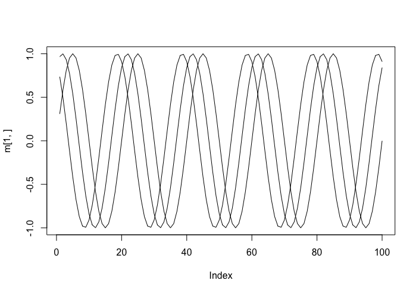
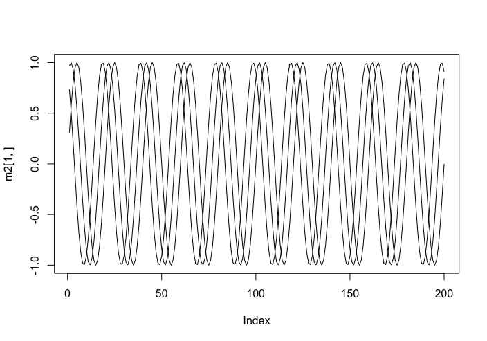
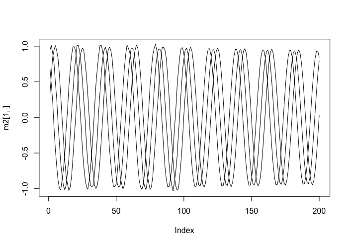

## Koopman Dynamic Mode Decomposition Prediction

This is an experimental R package implementing Koopman Matrix Dymanic Mode Decomposition Machine Learning and Prediction. Example with a trivial matrix:

```
library(Rdmd)
# Create a trivial test matrix
m<-matrix(ncol=10,nrow=3)
m[1,]<-1:10
m[2,]<-2:11
m[3,]<-3:12
```
The resulting matrix looks like this:
```
     [,1] [,2] [,3] [,4] [,5] [,6] [,7] [,8] [,9] [,10]
[1,]    1    2    3    4    5    6    7    8    9    10
[2,]    2    3    4    5    6    7    8    9   10    11
[3,]    3    4    5    6    7    8    9   10   11    12
```
Now we run the matrix through our decomposition function to generate a `kdmd` object, which is efectively our model.
```
# Obtain the Koopman Matrix
A<-getAMatrix(m)
```
The A matrix can be fed into the packages's `predict` generic for objects of class `kdmd` and for the trivial case we ask it to return that matrix plus one additional column - the predicted next column.
```
# predict the next column of data
predict(A,m,1)

```
The result is exactly what we would expect:

```
     [,1] [,2] [,3] [,4] [,5] [,6] [,7] [,8] [,9] [,10] [,11]
[1,]    1    2    3    4    5    6    7    8    9    10    11
[2,]    2    3    4    5    6    7    8    9   10    11    12
[3,]    3    4    5    6    7    8    9   10   11    12    13
```

This trivial example can predict accurately for many columns (possibly indefinitely)

```
predict(A,m,9)

    [,1] [,2] [,3] [,4] [,5] [,6] [,7] [,8] [,9] [,10] [,11] [,12] [,13] [,14] [,15] [,16] [,17] [,18] [,19]
[1,]    1    2    3    4    5    6    7    8    9    10    11    12    13    14    15    16    17    18    19
[2,]    2    3    4    5    6    7    8    9   10    11    12    13    14    15    16    17    18    19    20
[3,]    3    4    5    6    7    8    9   10   11    12    13    14    15    16    17    18    19    20    21
```

Let's take a slightly more complex example:

```
m<-matrix(ncol=100,nrow=3)
x<-1:100
m[1,]<-sin(x*pi/10)
m[2,]<-sin(1+x*pi/10)
m[3,]<-sin(2+x*pi/10)
```
 This generates a matrix of sin waves:
 

Let's predict the next 100 elements:

```
A<-getAMatrix(m)
m2<-predict(A,m,100)
plot(m2[1,], type='l')
lines(m2[2,], type='l')
lines(m2[3,], type='l')
```



Now let's add a small amount of Gaussian noise

```
m[3,]<-m[3,]+rnorm(100,sd=.02)
m[2,]<-m[2,]+rnorm(100,sd=.02)
m[1,]<-m[1,]+rnorm(100,sd=.02)
```


When we predict again, the predicted columns (101-200) have "rejected" the noise, acting as a filter:

```
A<-getAMatrix(m)
m2<-predict(A,m,100)
plot(m2[1,], type='l')
lines(m2[2,], type='l')
lines(m2[3,], type='l')
```

